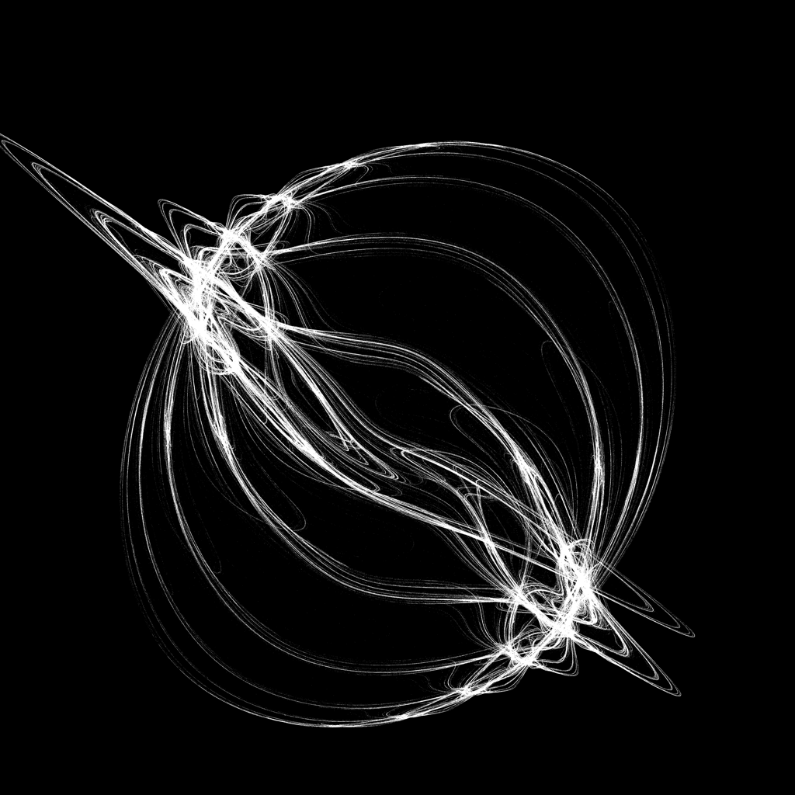
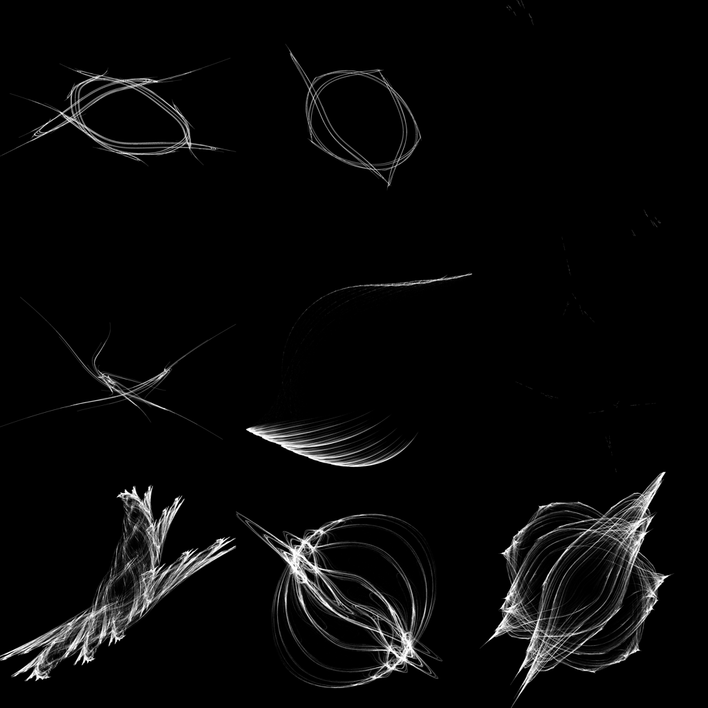

# CUDA Fractal Renderer

Quickly render fractals in CUDA

| Example Fractal (seed=7) | Example Fractals (seeds=0..8) |
| ------------------------ | ----------------------------- |
|  |  |

## Setup

- Install CUDA (https://developer.nvidia.com/cuda-downloads) and uv (https://docs.astral.sh/uv/).
- Install dependencies and create the virtual environment:

```bash
uv sync
```

## Usage

```bash
uv run cuda_fractal_renderer
```

The `--seed` argument can be used to generate a different fractal. The default seed is 0.

The `--grid-size` argument can be used to generate a square grid of fractals in parallel. The default grid size is 1 (just a single fractal).

View the rendered image in `output.png`.

## Formatting

Format and check the code with ruff:

```bash
./format.sh
```
